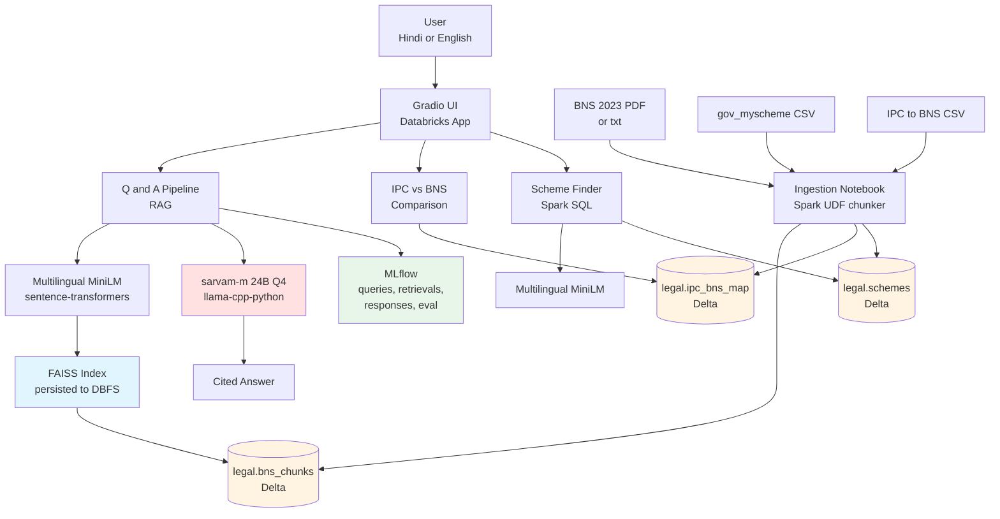

# Nyaya-Bodh Architecture

## High-level diagram

## Data flow

1. Source data (BNS Gazette text, gov_myscheme CSV, IPC-to-BNS mapping CSV) is ingested through the `01_data_ingestion` notebook. A Spark UDF tokenises and chunks the BNS text into 512-token windows with 64-token overlap. Three Delta tables are produced under the `legal` database.

2. The `02_build_embeddings` notebook reads `legal.bns_chunks`, computes embeddings via `paraphrase-multilingual-MiniLM-L12-v2` (sentence-transformers), builds a `faiss.IndexFlatIP` over L2-normalised vectors, and persists both the index and metadata to `/dbfs/FileStore/nyaya_bodh`.

3. At request time, the Gradio app routes the user query to one of three handlers:
   - The Q and A handler embeds the query with MiniLM, retrieves the top 5 chunks from FAISS, builds a grounded prompt, and calls sarvam-m (loaded via llama-cpp-python). The system prompt enforces citation, language matching, and a no-hallucination constraint.
   - The IPC vs BNS handler does a normalised lookup against `legal.ipc_bns_map`.
   - The scheme finder embeds the query and ranks `legal.schemes` rows by cosine similarity.

4. Every query is logged to MLflow with parameters (model name, context window, top k), metrics (latency, citation count), and a JSON artifact containing the full trace.

5. The `03_evaluation` notebook runs the eval set, reports retrieval hit-at-k, and uses sarvam-m as a judge to score correctness and citation quality. All metrics are logged to MLflow.

## Databricks components used

| Component | Where | Purpose |
| --- | --- | --- |
| Delta Lake | `legal.bns_chunks`, `legal.schemes`, `legal.ipc_bns_map` | Versioned structured storage for corpus and lookup tables |
| Apache Spark | Ingestion notebook | Distributed chunking via UDF over the BNS corpus |
| Spark SQL | Scheme retrieval, IPC lookup | Filtered reads from Delta |
| FAISS on DBFS | `/dbfs/FileStore/nyaya_bodh/faiss.index` | Semantic retrieval index |
| MLflow | All runs | Tracking queries, retrievals, evaluation metrics |
| Databricks Apps | `app/app.py` | User-facing Gradio interface |

## Models

- **Chat / generation**: `sarvam-m` (24B parameters, Apache 2.0) loaded from a local GGUF file via `llama-cpp-python`. Q4_K_M quantisation makes it viable on CPU. The model is loaded once per process and cached as a singleton because cold-start is 30 to 60 seconds.

- **Embeddings**: `sentence-transformers/paraphrase-multilingual-MiniLM-L12-v2` (Apache 2.0). 384-dimensional embeddings. Supports Hindi, English, and ~50 other languages. Runs on CPU at roughly 50 sentences per second.

Both are open source and built (sarvam-m) or strongly aligned (MiniLM is multilingual including Indian languages) with Indian-language workloads, satisfying the hackathon's open-source-only and prefer-Indian-models requirements.

## Hardware requirements

- **RAM**: 16 GB minimum to load sarvam-m 24B Q4_K_M, 24 GB recommended for headroom plus the embedding model and FAISS index.
- **Disk**: 16 GB free for the GGUF file.
- **CPU**: any modern x86_64 with 4+ cores. 8+ cores recommended for usable inference speed.
- **GPU**: optional. Requires a CUDA-enabled `llama-cpp-python` build and `LLAMA_N_GPU_LAYERS` set above 0.

If 16 GB RAM is not available, swap to `sarvam-1` (2B parameters, ~1.5 GB Q4_K_M, same code path).
